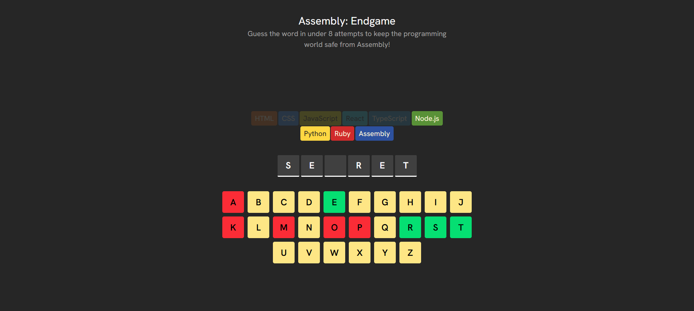

# 💻 Assembly: Endgame

A word-guessing game built with React, Vite, and Tailwind CSS. Save the programming world from complete Assembly takeover by guessing the hidden word before all high-level languages disappear!

## 🔗 Links

- **Live Site:** [View Live Demo](https://hangman-assembly-endgame.vercel.app/)
- **GitHub Repository:** [View Source Code](https://github.com/iviktorry/hangman-assembly-endgame)

---

## 🛠 Tech Stack

- **JavaScript (ES6+)** — Core game logic, array manipulation (`.map()`, `.filter()`, `.every()`, `.includes()`), and helper utilities
- **React** — Component-based architecture, derived states, and lazy initialization
- **Tailwind CSS** — Custom styling, typography, and responsive layouts
- **react-confetti** — Celebratory particles on victory
- **Vite** — High-performance build tool

---

## ✨ Features & Gameplay Rules

- **Programming Language Lives:** Each wrong guess eliminates a high-level language (JavaScript, Python, React, etc.) until only Assembly remains.
- **Dynamic Farewells:** Displays contextual farewell messages whenever a language goes extinct.
- **Visual Word Status:** Reveals correctly guessed letters in real-time, with automatic end-game state highlighting.
- **Full Accessibility (a11y):** Screen-reader friendly layout utilizing `sr-only` aria announcements (`blank.` vs actual letters) and interactive button attributes (`disabled`, `aria-pressed`).
- **Celebratory Particle Effects:** Fullscreen confetti effect upon successfully saving the tech ecosystem.

---

## 🧠 What I Learned & Practiced

- **Minimal State Architecture:** Avoided redundant states by computing game logic (e.g., `wrongGuessCounter`, `isGameLost`, `isGameWon`, `farewellText`) purely on the fly derived from `word` and `clickedLetters`.
- **Accessible Screen Reader Output:** Built dedicated `sr-only` descriptions mapping over letter elements to provide audible feedback for visual blanks (`blank.`).
- **Clean Component Encapsulation:** Passed isolated value updates through top-down callbacks (`handleClick={() => handleClick(item)}`) rather than manipulating target elements via raw DOM events.
- **Utility Modules:** Separated pure JavaScript logic (`getRandomWord`, `getFarewellText`) from React component rendering into external helper modules.
- **Lazy State Initialization:** Initialized random word state lazily (`useState(() => getRandomWord())`) to prevent unnecessary recalculations on re-renders.
- **Advanced Array Operations:** Leveraged native JavaScript methods (`.filter()` for wrong guess calculations, `.every()` for win detection, and `.includes()` for letter state checks) to process state efficiently.

---

## 🙋‍♀️ Author

- GitHub — [@iviktorry](https://github.com/iviktorry)
- Frontend Mentor — [@iviktorry](https://www.frontendmentor.io/profile/iviktorry)
