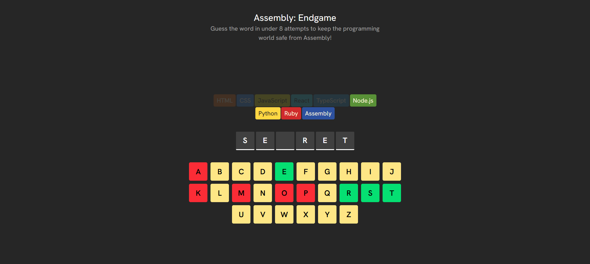

# 💻 Assembly: Endgame

A word-guessing game built with React, TypeScript, Vite, and Tailwind CSS. Save the programming world from complete Assembly takeover by guessing the hidden word before all high-level languages disappear!

## 🔗 Links

- **Live Site:** [View Live Demo](https://hangman-assembly-endgame.vercel.app/)
- **GitHub Repository:** [View Source Code](https://github.com/iviktorry/hangman-assembly-endgame)

---

## 🛠 Tech Stack

- **TypeScript & React** — Type-safe component architecture, strict prop interfaces, derived states, and lazy state initialization
- **Tailwind CSS** — Custom styling, typography, responsive layouts, and official plugins
- **react-confetti** — Celebratory particles on victory
- **Vite** — High-performance build tool

---

## ✨ Features & Gameplay Rules

- **Refactored to TypeScript:** Originally written in JavaScript (JSX) and fully migrated to TypeScript (TSX) with strict type safety for props, states, and utility handlers.
- **Tailwind CSS Plugins:** Integrated official Tailwind plugins to enhance layout, typography, and styling workflow.
- **Programming Language Lives:** Each wrong guess eliminates a high-level language (JavaScript, Python, React, etc.) until only Assembly remains.
- **Dynamic Farewells:** Displays contextual farewell messages whenever a language goes extinct.
- **Visual Word Status:** Reveals correctly guessed letters in real-time, with automatic end-game state highlighting.
- **Full Accessibility (a11y):** Screen-reader friendly layout utilizing `sr-only` aria announcements (`blank.` vs actual letters) and interactive button attributes (`disabled`, `aria-pressed`).
- **Celebratory Particle Effects:** Fullscreen confetti effect upon successfully saving the tech ecosystem.

---

## 🧠 What I Learned & Practiced

- **JSX to TSX Migration:** Refactored the entire codebase from JavaScript to TypeScript. Practiced typing React component props, `useState` hook setters (`Dispatch<SetStateAction<T>>`), and event handlers.
- **Strict Type Safety:** Handled complex derived types, boolean coercion (`Boolean()`), and edge-case values (e.g., avoiding falsy `0` leakage in string templates).
- **Minimal State Architecture:** Avoided redundant states by computing game logic (e.g., `wrongGuessCounter`, `isGameLost`, `isGameWon`, `farewellText`) purely on the fly derived from `word` and `clickedLetters`.
- **Accessible Screen Reader Output:** Built dedicated `sr-only` descriptions mapping over letter elements to provide audible feedback for visual blanks (`blank.`).
- **Clean Component Encapsulation:** Passed isolated value updates through top-down callbacks (`handleClick={() => handleClick(item)}`) rather than manipulating target elements via raw DOM events.
- **Utility Modules:** Separated pure utility logic (`getRandomWord`, `getFarewellText`) from React component rendering into external typed modules.
- **Lazy State Initialization:** Initialized random word state lazily (`useState(() => getRandomWord())`) to prevent unnecessary recalculations on re-renders.

---

## 👩‍💻 Developer Contacts & Socials

